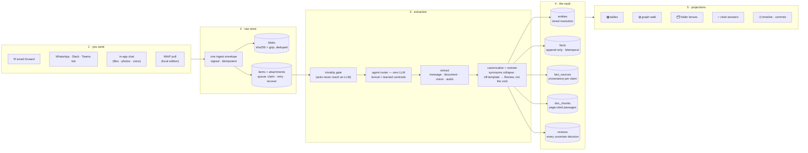
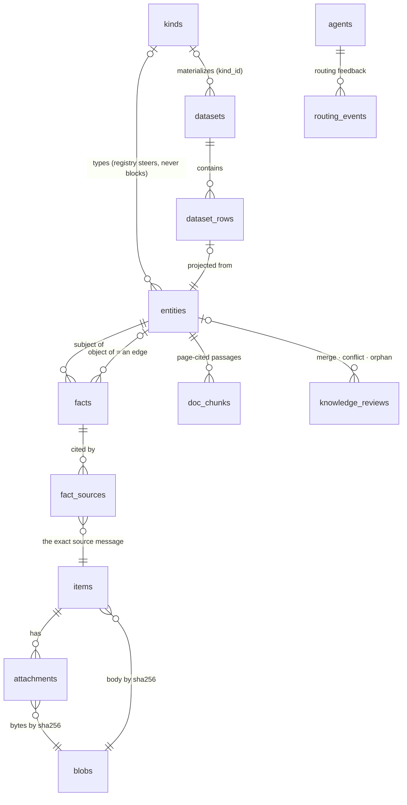

# datamodo

**Forward the mess — get a knowledge vault back.**

datamodo turns unstructured personal communications — forwarded emails, chat
messages, PDFs, photos, voice notes, spreadsheets — into **structured,
reviewable, queryable data**. You keep the original of everything; datamodo
extracts the meaning into one canonical vault and derives every useful shape
from it: tables, a knowledge graph you can walk, flexible folders, timelines,
and grounded answers with citations.

The trust story is the product: **every claim has provenance, every inference
is reviewable, nothing is ever silently lost or merged.**

> **Individual-only.** No teams, no sharing — every agent, dataset and fact is
> private to its owner. datamodo is your vault, not a workspace.

---

## Run it locally

The **local edition** runs the whole app on your machine: one user, no login,
an embedded database, your files on your disk. Prereqs: **Node ≥ 20** —
nothing else. (A published `npm install -g datamodo` is the goal but not live
yet; today you run it from a clone.)

```bash
git clone <this-repo> datamodo && cd datamodo
npm install
node bin/datamodo.mjs serve         # → http://localhost:4321  (no login)
```

On first run `serve` builds the app, creates your vault in `~/.datamodo`, and
boots an embedded Postgres (pglite, with pgvector + pg_trgm — no Docker, no
DB install). Subsequent runs start instantly. Open **http://localhost:4321**
and you land straight in the dashboard.

**Choosing the AI** — switchable any time in Settings, never a reinstall:

| Mode | What runs | Cost |
|---|---|---|
| **Local** (default) | [Ollama](https://ollama.com/download) models on your machine (`datamodo setup` sizes them to your RAM) | free, private, offline |
| **Bring your own key** | Anthropic / OpenAI / OpenRouter, or any OpenAI-compatible server | your key — with a built-in spend ledger and monthly cap |

> **Your Claude Pro (or ChatGPT Plus) subscription is _not_ an API key** and
> can't power the pipeline. But it has its own door: **Settings → Connect
> Claude (MCP)** exposes your vault as tools, and Claude — on your
> subscription — reads your inbox, extracts, and writes back.

Without any model configured, datamodo still captures and files everything
(keyword search, metadata-only nodes) — AI reading resumes the moment a model
appears. **Semantic search runs locally out of the box**: with no cloud key,
embeddings point at Ollama (`ollama pull nomic-embed-text`) and the embedded
DB sizes its vector columns to match.

**Capture mail** — a local install has no public URL for webhooks, so it
*pulls*: add a mailbox in **Settings → Mailboxes**, or

```bash
node bin/datamodo.mjs connect --host imap.gmail.com --user you@gmail.com --pass <app-password>
```

Everything you own lives in `~/.datamodo` (`pgdata/`, `blobs/`, `llm.json`,
`connectors.json`) — back up that folder and you've backed up everything.
Point `DATABASE_URL` at your own Postgres (initialize it with
[`neon/schema.sql`](neon/schema.sql)) to skip the embedded one, or use the
Docker Compose bundle in [`packaging/local/docker/`](packaging/local/docker/)
(app + `pgvector/pgvector:pg16`).

```
datamodo serve      run the dashboard (http://localhost:4321)
datamodo setup      re-size the local AI: RAM → model tier → pull
datamodo connect    attach an IMAP mailbox (pull-based capture)
datamodo build      force a clean rebuild (e.g. after git pull)
```

---

## What datamodo does (and aims to do)

Most personal-data tools make you *file* things. datamodo's bet is the
opposite: **capture is a gesture** (forward, drop, dictate — never
account-slurping), and structure is *derived*, never maintained by hand.

- **You send** — forward an email, message the WhatsApp/Slack/Teams bot, drop
  a file or voice note into the in-app chat, or point the local edition at
  your own mailbox.
- **datamodo keeps the original** — content-addressed, deduplicated,
  immutable.
- **AI extracts the meaning** — entities (people, companies, invoices,
  documents, concepts…) and facts about them, steered by *your* category
  templates and *your* agents' purposes.
- **One canonical vault** stores a single clean version of everything, with
  full history and a receipt for every claim.
- **Every view is a projection** — tables, graph, folders, timeline, answers
  are all computed from the vault. Delete every view and nothing is lost.

The north star: stand on any node and **walk the graph edge to edge**, seeing
each node in its natural shape — a record as a table, a document as its page,
an image as the image, audio as a player with its transcript. An edge is
never just a line: it's a fact carrying meaning, time, confidence, and the
exact source messages.

---

## How it works — the pipeline



Stage by stage:

- **Ingest** normalizes every channel into one envelope, verifies signatures,
  and is idempotent — re-forwarding the same file creates nothing new.
- **Extraction** runs on a queue (cron + post-request self-kick) with atomic
  claiming, orphan recovery and a retry cap. Messages extract free-range;
  documents **classify first** and are restrained to their category's
  template; images ride a vision call; audio transcribes, then follows the
  document path. Every stage **fails soft**: no key, no vision model, bad
  bytes — the item degrades (e.g. to a metadata-only node), it never fails.
- **The vault** resolves identity through a ladder (details below), appends
  facts bitemporally, and files anything uncertain as a review instead of
  guessing.
- A daily **consolidation worker** keeps the graph healthy in the background
  (merges, orphan flags, vocabulary proposals, embedding backfill).

---

## The data model

One Postgres, one schema, scoped per user. The graph is deliberately **not**
a graph database: canonical storage is append-only relational facts, and the
graph is a derived index over them. (The access patterns are 1–2 hops +
similarity + time — all Postgres-shaped — and aggregation belongs to SQL:
"graphs are bad at numbers.")



- **`items` / `attachments` / `blobs`** — the raw layer. Blobs are
  content-addressed (sha256 + gzip, ref-counted); originals are immutable.
- **`entities`** — one node shape for everything: a person, an invoice, a
  PDF, a concept. Carries a canonical label, natural keys (email, phone,
  invoice number…), an embedding, and a markdown body — documents and notes
  render as Obsidian-flavored pages with `[[wikilinks]]` that resolve to
  real nodes.
- **`facts`** — the heart. Append-only and **bitemporal** (`valid_from` /
  `valid_to` + recorded time). A contradiction never overwrites — it
  *supersedes*, so "what did we believe in March?" stays answerable. A fact
  whose object is another entity **is** an edge; the graph is exactly the
  set of entity-valued facts.
- **`fact_sources`** — provenance: every fact points at the exact message(s)
  supporting it. Answers must cite or they don't render.
- **`doc_chunks`** — passages from inside documents (with embeddings), so
  answers can quote a PDF page, not just facts about it.
- **`kinds`** — the user-editable ontology: category templates (fields +
  relations) that steer extraction and canonicalize vocabulary.
- **`datasets` / `dataset_rows`** — tables. A category IS a table: rows
  auto-materialize from facts; your hand edits are protected; agent changes
  arrive as reviewable proposals.
- **`knowledge_reviews`** — the decision queue: merges, conflicts,
  low-confidence extractions, category/field proposals, orphan flags.

---

## Why the graph doesn't degenerate

Extraction pipelines rot in three ways: duplicate entities pile up,
vocabulary sprawls, junk accumulates. datamodo has a mechanism against each,
under one standing rule: **similarity is never trusted alone.**

**Identity — the resolution ladder.** A new mention resolves by: exact
natural key (email, invoice no.) → trigram label blocking → ANN embedding
recall → **LLM adjudication under a confidence policy** (≥ .85 auto-merges,
≥ .55 becomes a merge *proposal*, below is recorded as rejected so the pair
is never re-asked). Cosine/trigram closeness only *recalls candidates* — it
never merges by itself. "Acme Corp" and "Acme Inc" become one node only when
keys, facts, or adjudication say so; uncertain merges wait for your click.

**Homeostasis — the nightly consolidation worker.** A daily pass per vault:
backfills missing embeddings, sweeps for near-duplicate pairs the write path
couldn't see (adjudicated on both sides' actual facts), and flags unlinked
strays as one batched *orphan review* — it never silently deletes, accepting
only prunes what is **still** unlinked at accept time, and entities you
recently read are never flagged (usage-weighted retention).

**Vocabulary — telemetry + a growth gate.** Synonym predicates collapse at
write time; an *Ontology health* card tracks per-kind conformance and
new-predicate rates; when an off-template predicate gets hot (≥ 3 facts) the
worker files a **field proposal** — accept and the template grows, decline
and it never asks again. Look-alike predicates become *alias* proposals so
future writes collapse automatically.

**Structure — the template guarantee.** Every node of a templated kind
carries at least its template fields (null-filled when unknown), so tables
can always just read the metadata; the first real value fills a null slot
silently — completion, not conflict.

**History — nothing destructive.** Facts supersede rather than update,
merges tombstone-and-repoint rather than delete, and every automatic
decision is logged as a review. The result is a git-style history: one
commit per extraction run with its diff, plus per-entity blame.

---

## Why it stays cheap

LLM spend is bounded by structure, not hope:

- **Plumbing is zero-LLM by law.** Anything that runs on *every* item —
  agent routing, folder trees, table materialization, chunk scoring — is
  deterministic code. The agent router is lexical matching plus learned
  per-agent centroids (it improves from your accepts/dismissals, no training
  infra), and it shares the **one** embedding call per message with entity
  priming.
- **A triviality gate** — "ok thanks 👍" never reaches an LLM at all.
- **Prompt caching** — the per-vault prompt prefix (categories, templates)
  is stable, so providers cache it (~90% input discount on Anthropic).
- **Unbounded documents, bounded prompts** — a 500-page PDF is fully read,
  chunked, stored and searchable, but the LLM reads a scored *selection*
  (headings, numeric density, position, your templates' vocabulary, semantic
  closeness to your business context) inside a fixed budget. A 200-page
  paper costs the same prompt as a 20-pager, and its appendix stays citable.
- **Confidence-gated escalation** — a cheap model extracts; a stronger one
  is called only when confidence is low. Merge adjudication runs only when
  plausible candidates exist (similarity floor + top-3 cap).
- **Generation is on-demand only** — syntheses, dossiers, derived tables run
  when you ask. LLM spend maps 1:1 to your curiosity, never to a background
  trigger.
- **BYOK with receipts** — your key's usage lands in a ledger (exact cost on
  OpenRouter, estimated elsewhere) with an optional monthly cap that pauses
  the key before it overspends.

---

## Why retrieval works

Answers are **graph-first** (GraphRAG) — vectors assist, scoped, instead of
deciding:

1. **Link the query to the graph** — entities literally named in the
   question, plus ANN over entity embeddings (one shared query embedding).
2. **Traverse facts** — the seeds' facts and their best neighbors' facts are
   the primary evidence. Multi-hop questions ("which invoices belong to the
   client Maria introduced?") find evidence keyword search never would.
3. **Drop into documents, scoped** — semantic passage search runs *inside
   the linked neighborhood*; keyword recall stays global; exact matches are
   never outranked by fuzzy ones.
4. **Citations come free** — evidence rides the provenance machinery, so
   every answer carries `[n]` citations that drill to the exact message or
   PDF page, and one click shows the answer *in* the graph, cited nodes
   highlighted.

Two invariants keep this honest: **one embedding space per deployment**
(every vector is stamped with its model; stale vectors degrade to trigram
instead of poisoning matches — change models and a requeue re-embeds) and
**bitemporal reads** (current claims by default, as-of-a-date on demand).

---

## What it enables

Because the vault is canonical and views are projections, the same data
wears many shapes — and adding a shape never risks the data:

- **▦ Tables that build themselves.** A category is a table: facts
  auto-materialize into rows, hand edits are protected, agent updates arrive
  as proposals. Or *describe* a table in plain language — datamodo designs
  it over the graph schema, previews it honestly, and materializes it
  (**derive-a-table**). Tables flow outward too: idempotent one-way **sync
  into your own Postgres**, and Excel export.
- **◍ A graph you can walk.** Stand on a node, walk edge to edge, scroll out
  into concentric rings of the whole neighborhood. Every edge click opens
  the fact behind it — confidence meter, valid-since, corroboration, quoted
  evidence. A parallel whole-vault WebGL canvas (⊛ Graph) shows everything
  at once.
- **🗂 Folders that are opinions, not locations.** A folder is a projection
  over facts, so one corpus organizes into *many* trees — by client,
  project, person, topic, month, type — in a Finder-style column view you
  compose to any depth. A document linked to two clients appears in both
  folders. Nothing is ever moved; export any tree as a .zip of originals.
- **⌕ Ask anything, get receipts.** Grounded answers with citations, quotes
  from inside documents, and a "see in graph" button.
- **◷ Total recall.** A timeline of what happened and what's upcoming; a
  git-style commit log of every extraction run; per-entity blame. Approve or
  decline decisions from Review Studio, the chat thread, or by replying
  "1 yes" on WhatsApp/Slack.
- **∑ Insights.** Live aggregation — any measure across any axis of the
  vault. *Honest note: this tab is early and rough; it's next in line for a
  redesign.*
- **✦ On-demand synthesis.** One click writes a cited cross-document note on
  any entity page; dossiers export as cited markdown.
- **MCP — your vault on your Claude subscription.** A 14-tool MCP server
  (search, graph walk, facts with as-of, passages, tables, capture,
  extraction submission, reviews) with OAuth for claude.ai connectors.
  Ships in both editions, each instance bound to its own vault.

---

## Stack

| Layer | Choice |
|---|---|
| App | Next.js 16 · React · TypeScript |
| Database (cloud) | **Neon Postgres 18** with **pgvector** (ANN) + **pg_trgm** (fuzzy blocking); DB branches mirror git (`prod` / `dev`) |
| Database (local) | **pglite** (WASM Postgres, same extensions) embedded in-process — or any Postgres via `DATABASE_URL` |
| ORM | Prisma 7 (`@prisma/adapter-neon` cloud · `@prisma/adapter-pg` local); schema source of truth: [`neon/schema.sql`](neon/schema.sql) |
| Auth | Neon Auth (Better Auth) in cloud; **no login at all** locally. Authorization is app-layer scoping — every table keys on the owner |
| Blobs | Cloudflare R2 (S3-compatible) in cloud · plain filesystem locally — one `putBlob`/`getBlob` chokepoint |
| LLM | Provider-agnostic: OpenRouter / OpenAI / Anthropic / **Ollama (keyless)**; per-user BYOK; embeddings + Whisper-shaped transcription — all fail-soft |
| Email in | Cloudflare Email Worker → `POST /api/ingest` |
| Jobs | GitHub Actions cron: extraction tick + daily consolidation (plus a post-request self-kick so chat feels live) |
| Tests / CI | `node:test` over dependency-free pure cores; CI = tests + tsc + lint baseline + build + dependency-boundary check |

The codebase is split mechanically into an **open-eligible core** (dashboard,
pure cores, pipeline, local adapters) and a **closed cloud layer** (auth,
billing, hosted channel webhooks) — enforced by dependency-cruiser in CI,
with exactly five seam files allowed to cross. The local package is a
build-time prune of the core with the seams swapped for local
implementations, so the published artifact contains no cloud code at all.

## Repository map

```
app/                 Next.js app: dashboard, API routes, landing
lib/datamodo/        the product's logic — pure cores (import-free, unit-tested)
                     beside their DB/LLM shells: extract, knowledge, consolidate,
                     explorer, folder-lenses, derive-table, graphrag, …
lib/llm/             provider-agnostic LLM / embeddings / transcription clients
lib/ingest/          capture envelope + raw store
lib/local/           local edition: config, embedded DB, model sizing, IMAP poller
neon/                schema.sql (the one faithful schema) + idempotent migrations
prisma/              Prisma schema (pulled from the DB)
workers/             Cloudflare email-ingest worker
bin/                 the `datamodo` CLI
packaging/           local-edition packaging: prune build, Docker, installers
docs/                the living docs (below)
tests/               node:test suites over the pure cores
```

**The living docs are the deep dive** — updated with every commit:
[`docs/MEMORY.md`](docs/MEMORY.md) (aim, decisions, invariants) ·
[`docs/STATE.md`](docs/STATE.md) (every feature → the code responsible + env
matrix) · [`docs/FLOW.md`](docs/FLOW.md) (pipeline infographic) ·
[`docs/ROADMAP.md`](docs/ROADMAP.md) (what's next) ·
[`docs/GRAPH_PIPELINE.md`](docs/GRAPH_PIPELINE.md) (the end-to-end graph
pipeline reference).

> This repo runs a modified Next.js — read the guides in
> `node_modules/next/dist/docs/` before writing framework-touching code
> (see [`AGENTS.md`](AGENTS.md)).

## Development

```sh
npm test                      # unit tests (pure cores — no DB, no network)
npx tsc --noEmit              # types
npm run lint                  # eslint (CI compares against a fixed baseline)
npm run lint:boundary         # core must not import the closed cloud layer
npm run build                 # next build
npm run shoot                 # screenshot harness: renders key views in
                              # headless Chromium from fixtures — no DB/login
DATAMODO_TEST_DB=1 npm test   # + embedded-Postgres integration tests
```

Design system (cream canvas · warm ink · one coral accent · data in Geist
Mono) lives in `design/system/` — and the brand name is always lowercase
**datamodo**.
