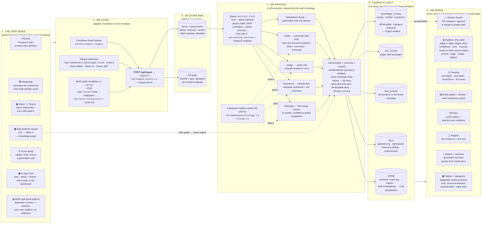

# datamodo — the flow (living infographic)

> **Maintained doc — update with EVERY commit that changes the pipeline or adds
> a feature to a stage.** Mermaid renders natively on GitHub, so this diagram is
> the always-current infographic: stages × features × stack in one picture.
> Siblings: [STATE.md](STATE.md) · [ROADMAP.md](ROADMAP.md) · [MEMORY.md](MEMORY.md).
>
> Last updated: 2026-07-17

## The one-picture version

## Stage detail (what · how · stack)

| Stage | What the user senses | How we do it | Stack / key files |
|---|---|---|---|
| **Send** | "Forward it to datamodo" — email address, bot DM, upload, or the in-app Chat (text · files · voice notes · dictation) | Gesture-based capture; identify-once link codes bind a sender handle to the user; the Chat route attributes by session, no codes needed | `forwarding_addresses`, `ingest_sources`, `channel_link_codes`, `app/api/chat` |
| **Listen** | Instant "got it" | Channel adapters normalize to `IngestEnvelope`; signature-verified; idempotent by `external_id` | `workers/email-ingest`, `app/api/webhooks/*`, `app/api/ingest` |
| **Store raw** | "The original is always kept" | sha256+gzip blob dedup (same file re-forwarded = one blob), items at `stored` | `lib/ingest/store.ts`, `lib/storage/blob.ts`, R2 |
| **Process** | Facts appear minutes later; unclear things ask for review | Cron + self-kick drain; claim/recover/retry; classify → extract → ground (zero-LLM evidence check: fabricated snippets / absent numbers cap confidence into the review gate) → canonicalize → reconcile (zero-LLM: broken refs drop, repeats collapse, values/keys normalize, declared/heuristic cardinality settles multi-values as coexisting list facts) → restrain; audio transcribes first (fail-soft) then follows the document path; low confidence escalates models, then to Review; a clearly weaker new value is HELD for review instead of silently overwriting a corroborated one | `lib/datamodo/extract.ts`, `ontology.ts`, `reconcile-core.ts`, `documents.ts`, `lib/llm/*` (incl. `transcription.ts`) |
| **Vault** | One clean version of every fact, with receipts | Tiered entity resolution (never a silent bad merge), bitemporal facts (contradictions supersede, never delete), provenance per claim | `lib/datamodo/knowledge.ts`, Neon (pgvector + pg_trgm) |
| **Derive** | Tables, graph, timeline, answers — all just *there*; on demand: describe a table or a folder tree and it builds itself out of the graph, and any answer can be shown IN the graph | Pure projections over the vault, computed live or auto-materialized; accept in Review = commit to the graph; prompt-shaped projections (derive-table, folder export) preview before anything is written | `lib/datamodo/{project,analytics,search,answer,timeline,concept-map,dossier,derive-table,folder-export,zip}.ts`, `app/dashboard/*` |

## Invariants (the flow's laws)
1. **Originals are immutable** — blobs are content-addressed; merge moves identity, never rewrites content.
2. **Facts are append-only** — a new value supersedes, history stays queryable (`valid_from`/`valid_to`).
3. **Every claim has provenance** — `fact_sources` points at the exact message; answers must cite or they don't render.
4. **Templates steer, never block** — messages free-range; documents restrained, but drops go to Review, not the void.
5. **Views derive** — deleting every projection loses nothing; the vault rebuilds them.
6. **Failure degrades, never breaks** — no key → no embeddings/vision/transcription, item still lands; bad attachment → `metadata_only` node.
